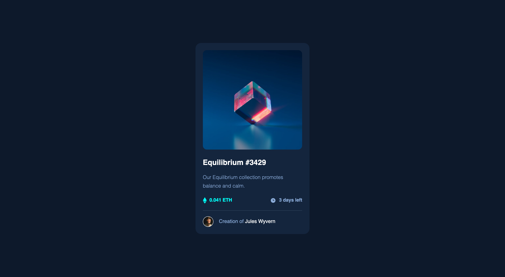

# Frontend Mentor - NFT preview card component solution

This is a solution to the [NFT preview card component challenge on Frontend Mentor](https://www.frontendmentor.io/challenges/nft-preview-card-component-SbdUL_w0U). Frontend Mentor challenges help you improve your coding skills by building realistic projects.

## Table of contents

- [Overview](#overview)
  - [The challenge](#the-challenge)
  - [Screenshot](#screenshot)
  - [Links](#links)
- [My process](#my-process)
  - [Built with](#built-with)
  - [What I learned](#what-i-learned)
  - [Continued development](#continued-development)
- [Author](#author)

## Overview

Build NFT Preview Card Component using HTML5 and CSS3.

### The challenge

Users should be able to:

- View the optimal layout depending on their device's screen size
- See hover states for interactive elements

### Screenshot



### Links

- Solution URL: [Click here](https://www.frontendmentor.io/solutions/nft-preview-card-component-H1GEorRV9)
- Live Site URL: [Click here](https://frontendmentor-nft-beryl.vercel.app/)

## My process

- create html structure, use reusable class like 'flex'
- import google font
- define css properties/variables
- create base style
- create reusable class (flex)
- create style for container
- create style for other elements

### Built with

- CSS custom properties
- Flexbox
- Mobile-first workflow

### What I learned

Usage some css properties like align-self, css values like em

```css
.subtitle {
  font-size: 0.8em;
  line-height: 1.7;
  font-weight: 300;
}
.desc {
  align-self: stretch;
  justify-content: space-between;
  font-size: 0.75em;
  font-weight: 600;
}
```

### Continued development

Reimplement using CSS Preprocessor like SASS

## Author

- Website - [Nazzal Ramzan Arifin](https://www.nazzalra.me)
- Frontend Mentor - [@r4mzn](https://www.frontendmentor.io/profile/r4mzn)
- Twitter - [@nazzalra](https://www.twitter.com/nazzalra)
